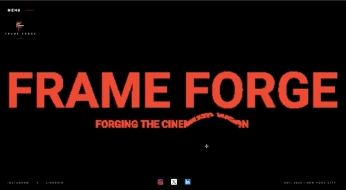

### Frame Forge | Cinematic Studio 🎬
``A high-performance, visually-driven portfolio designed for film production and digital cinematography.``

## 👤 Author
**Jacqueline**  
- [Live Demo](https://jdbostonbu-ops.github.io/frame-forge/) | [GitHub Profile](https://github.com/jdbostonbu-ops)

  

### 🎥 Key Technical Features
- **Compatibility**: Mobile iOS/Tablet/iPad compatible.
- **Cinematic Video Grid**: A custom-built "stack" of auto-playing 4K/8K video previews with optimized `playsinline` and `muted` attributes for mobile performance.
- **Advanced Motion Design**: Integration of **GSAP (GreenSock Animation Platform)** for ultra-smooth UI transitions and interactive elements.
- **Dual Canvas Engine**: Used AI to create a Dual-layered `<canvas>` rendering (`scatterCanvas` and `canvas1`) for dynamic, interactive background textures that respond to user movement.
- **Context-Aware Navigation**: A custom "Inquiry" and "Studio Toggle" navigation system designed for a minimal, immersive user experience.

### 🌐 Browser & Device Compatibility
This project is optimized for high-performance Chromium engines. For the best experience, use **Chrome** or **Edge**.

| Browser / Device | Status | Performance Notes |
| :--- | :--- | :--- |
| **Google Chrome** | ✅ Optimized | Full support for 4K/8K grid & GSAP transitions. |
| **Microsoft Edge** | ✅ Supported | Matches Chrome's rendering engine. |
| **Firefox** | ✅ Supported | Known alignment offset where the footer logo does not center correctly. |
| **iPad / iOS** | 🛠️ Partial | ~2s delay (iPhone) to ~13s delay (iPad) for canvas initialization; scroll is fluid. |
| **Apple Safari** | ⚠️ Not Recommended | Known rendering issue where scrolling content fails to appear over the `<canvas>` element on Mac. |

> **Technical Note:** While the interactive canvas has an initial loading delay on iPad/iOS, the scroll behavior is fully optimized to match the desktop Chrome experience.

> **Mobile UI Note:** There is a known alignment offset where the footer logo does not center correctly on iPad and iPhone viewports. This is a CSS flex-box refinement currently in progress.

### 🛠️ Tech Stack
- **Animations**: GSAP (GreenSock), HTML5 Canvas API
- **Frontend**: Vanilla JavaScript (ES6+), Semantic HTML5
- **Styling**: CSS3 (Custom Grid Layouts, Video Overlays, and Blur Textures)
- **Work**: Resolve-based color aesthetic applied to web UI
- **Form Submission:** [Free form submission](https://web3forms.com/) Web3Forms for serverless form handling, integrated with custom AJAX/Fetch logic and GSAP success states.

### 🎨 Design Philosophy
- **The "Forge" Concept:** The text "breaks apart" when the mouse gets near `(this.x -= dx / 10)` and then "re-forges" itself `(this.x += (this.homeX - this.x) * this.ease)` is aimed at branding.
- **Performance Minded:** Setting `willReadFrequently: true on the 2D context` is aimed at high-performance canvas scanning.
- **Technical Sophistication:** I am manipulating its geometry. Using data.data to find alpha `values > 0` and placing particles there.
- **Staggered Menu:** In my menuTl, I use stagger: 0.1. This "one-by-one" appearance of links makes the site feel "premium" and intentional.
- Frame Forge is built on the concept of **"The Cinematic Canvas."** The Frame Forge logo was created on [Canva](https://canva.com).
- Every transition is timed to mimic a film cut, and the "capabilities" section uses a brutalist, high-contrast aesthetic to mirror professional production call sheets.

### 📈 Activity & Contributions
- Active developer with a high-frequency contribution rhythm, focusing on deep development cycles for immersive web experiences.
- **Current Focus**: Optimizing WebGL/Canvas performance for mobile devices.
- **Daily Activity**: Check out my Contribution Graph for a real-time view of my development streak.

⭐ Love this project? Give it a star to show your support and help others with canvas creations!

